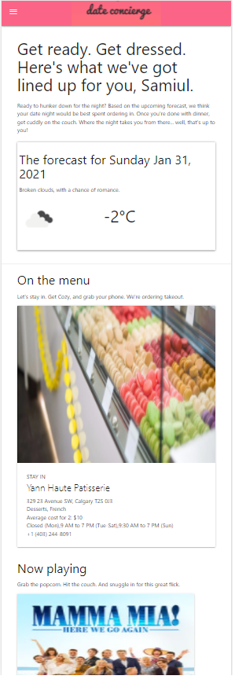

# Date Concierge (Bootcamp Project One)
<div align="center"></div>

### Project Description
**Problem we are solving** Does anyone really like planning a date? (No!) That’s what we’re here for. We’ll take the planning off your hands so the only worry you’ll have is what to wear.

**How we are solving it:** Our dating friends can use a calendar selector to tell us when they’ll be meeting up and what they’re in the mood for. Based on the weather and what they’ve told us they’re in for we will serve up either an indoor date idea in the comfort of their own homes or provide a suggestion of where they can meet up outside of their houses if the weather permits.

**Our deliverable:** A web application that will plan a suitable date in your city based on weather condition and your mood.

**Our target audience:** Daters everywhere. Well, daters in major cities at least.

### User Story

```
AS A dater
I WANT to tell the app what the vibe of a date should be
SO THAT I can receive a suggestion that matches the mood I’m trying to create

AS A dater
I WANT to be able to ensure the date is weather appropriate
SO THAT we don’t get rained out, snowed in or cancelled on because of the weather

AS A dater
I WANT to be able to save a list of good ideas
SO THAT I can get a list of ideas I like to come back to later and choose from

AS A dater
I WANT to be able to skip over recommendations that I don’t like
SO THAT I can find an option that interests me

AS A dater
I WANT be able to change the mood if it doesn’t suit me
SO THAT I can find an appropriate date for me

```

### Project Workflow

### Technologies and Libraries used in this project
* HTML
* CSS
* Javascript
* jQuery
* Materializecss framework

### API used in this project
* [Geolocation API](https://developer.mozilla.org/en-US/docs/Web/API/Geolocation_API): to obtain current user location.
* [Openweathermap API](https://openweathermap.org/api): to obtain weather forecast. 
* [Zomato API](https://developers.zomato.com/documentation): to obtain restaurant related information.
* [TMDB API](https://developers.themoviedb.org/3/getting-started/introduction): to obtain movie related information.
* [GeoApify](https://www.geoapify.com/geocoding-api): to get user location based on address/city name.

### Next Steps
* Look beyond dinner and a movie.
    * We like to explore other APIs to add some diversity to our dating options.
* Add reminder option
    * We also like to explore the possibilities of integrating scheduling APIs to set automatic reminder to ensure a successful date.

### Group members (Collaborators)
* Curtis Smith
* Hayley Vuylsteke
* Matthew Bianco
* Raed Altaki
* Samiul Choudhury

### Screenshot
#### On Large Screen


#### On Small Screen
</img>

### Project Pitch Presentation
[Click here to see our project pitch presentation](./assets/pdf/presentation.pdf)

### Application URL
[Click here to see the final outcome](https://projectoneteamfour.github.io/date-concierge/)